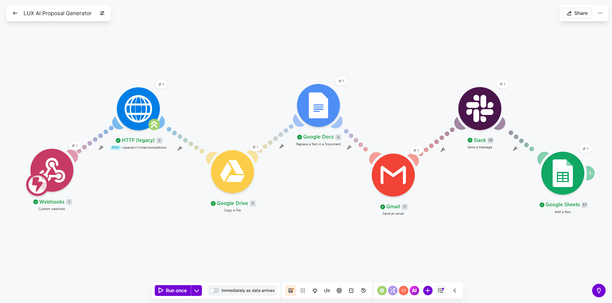
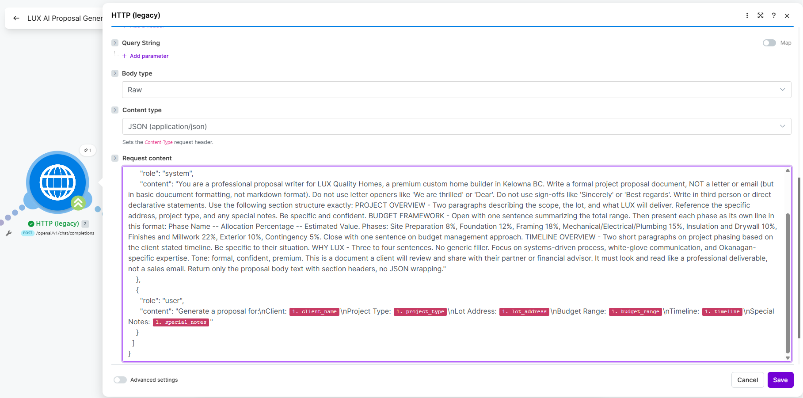
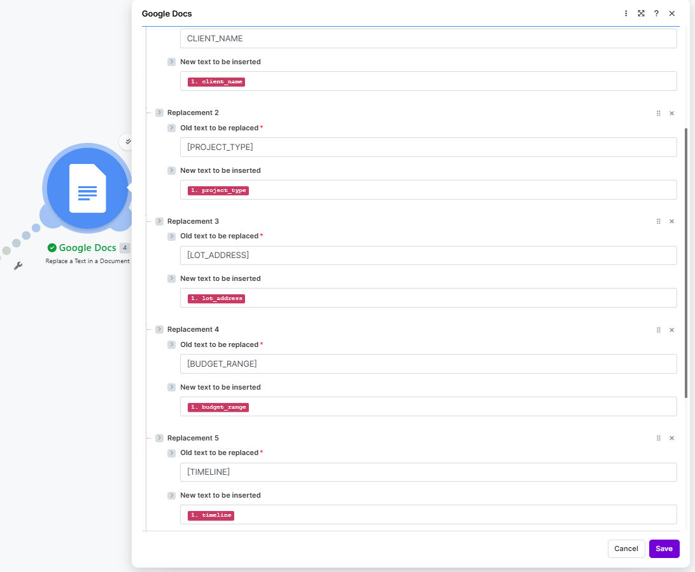
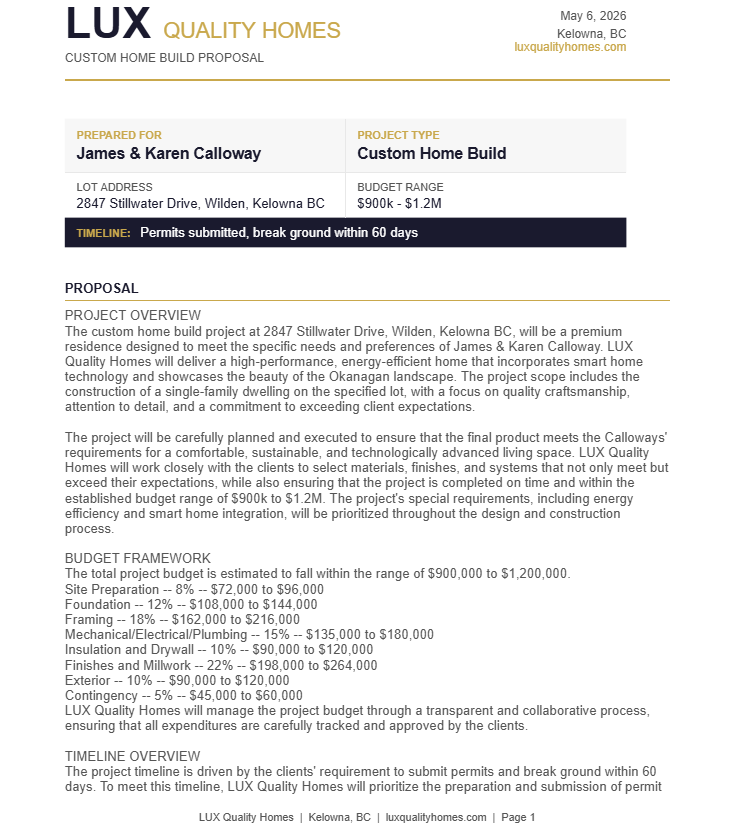
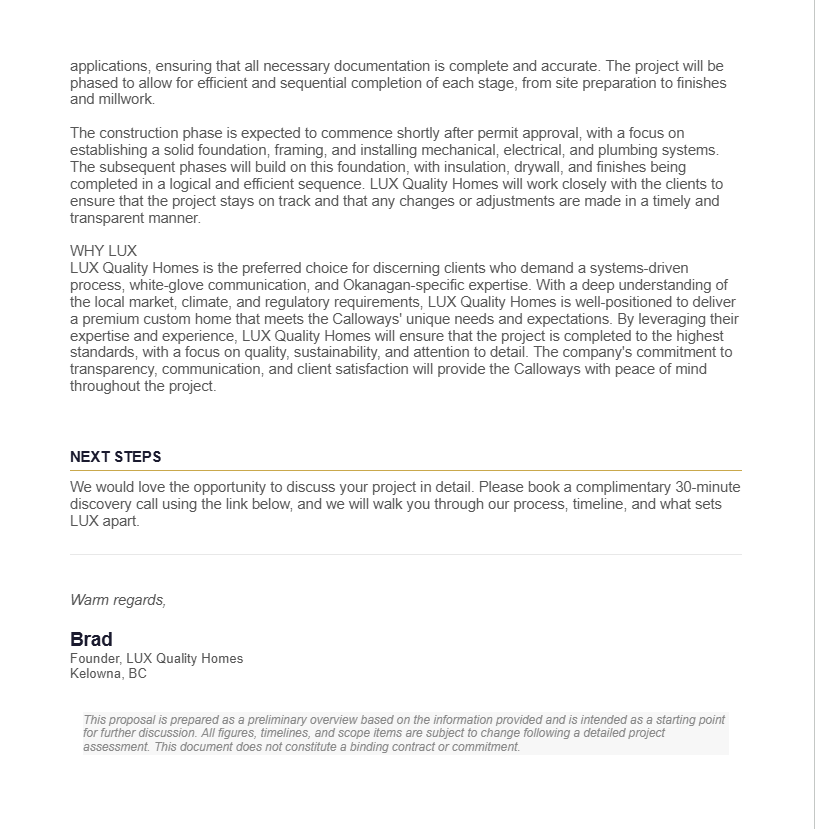
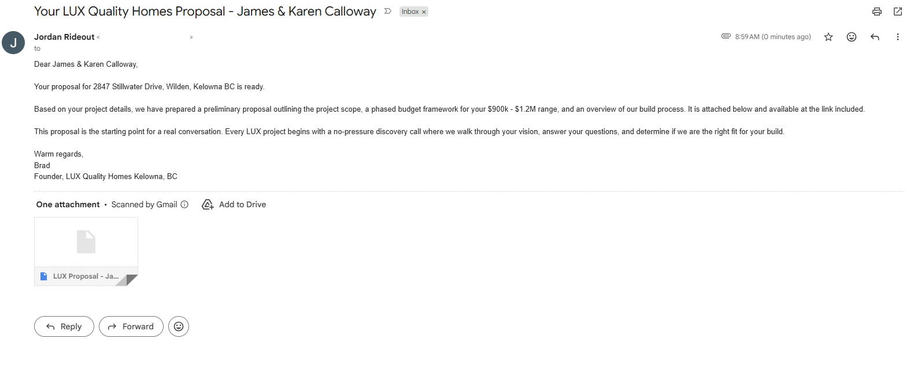
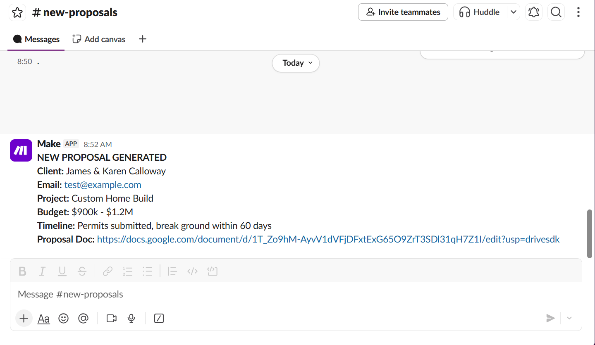
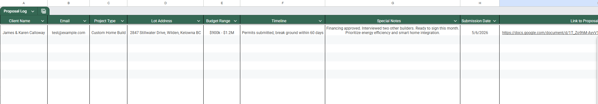

# AI Proposal Generator
### Built with Make.com | Groq AI | Google Docs | Google Drive | Gmail | Slack | Google Sheets


---

## Canvas Overview



---

## Project Description

A Make.com scenario that converts a lead form submission into a fully formatted,
client-ready custom home build proposal in under 30 seconds -- with zero manual involvement.

When a webhook receives project details, the scenario sends the data to Groq's LLM API
with a structured prompt that generates a formal proposal document including a project
overview, phased budget framework, timeline overview, and company positioning section.
The AI output is written into a copy of a branded Google Doc template using dynamic
placeholder replacement. The completed proposal is emailed to the client with a
personalised message, the internal team is notified in Slack, and a row is appended
to a Google Sheet proposal log for pipeline tracking.

Every output is specific to the client's project -- no generic language, no static templates.

---

## Tools and Integrations

| Tool | Role |
|---|---|
| Make.com | Scenario automation platform |
| Groq API (llama-3.3-70b-versatile) | AI proposal generation |
| Google Drive API | Template copying and file naming |
| Google Docs API | Dynamic placeholder replacement |
| Gmail API (OAuth2) | Client email delivery |
| Slack Webhook | Internal team notification |
| Google Sheets API | Proposal pipeline logging |

---

## Workflow Architecture

```
Webhook Trigger (lead form submission)
    └── Groq HTTP Request (generate proposal body)
            └── Google Drive: Copy Template (create named copy)
                    └── Google Docs: Replace Text (write all dynamic values)
                            └── Gmail: Send Email (client delivery with Doc link)
                                    └── Slack: HTTP Request (team notification)
                                            └── Google Sheets: Append Row (proposal log)
```

---

## Groq System Prompt

```
You are a professional proposal writer for LUX Quality Homes, a premium custom home
builder in Kelowna BC. Write a formal project proposal document, NOT a letter or email.
Do not use letter openers like 'We are thrilled' or 'Dear'. Do not use sign-offs like
'Sincerely' or 'Best regards'. Write in third person or direct declarative statements.

Use the following section structure exactly:

PROJECT OVERVIEW
Two paragraphs describing the scope, the lot, and what LUX will deliver. Reference the
specific address, project type, and any special notes. Be specific and confident.

BUDGET FRAMEWORK
Open with one sentence summarizing the total range. Then present each phase as its own
line in this format: Phase Name -- Allocation Percentage -- Estimated Value.
Phases: Site Preparation 8%, Foundation 12%, Framing 18%,
Mechanical/Electrical/Plumbing 15%, Insulation and Drywall 10%,
Finishes and Millwork 22%, Exterior 10%, Contingency 5%.
Close with one sentence on budget management approach.

TIMELINE OVERVIEW
Two short paragraphs on project phasing based on the client's stated timeline.
Be specific to their situation.

WHY LUX
Three to four sentences. No generic filler. Focus on systems-driven process,
white-glove communication, and Okanagan-specific expertise.

Tone: formal, confident, premium. This is a document a client will review and share
with their partner or financial advisor. It must look and read like a professional
deliverable, not a sales email. Return only the proposal body text with section
headers, no JSON wrapping.
```

**User message sent with each request:**
```
Generate a proposal for:
Client: {{1.client_name}}
Project Type: {{1.project_type}}
Lot Address: {{1.lot_address}}
Budget Range: {{1.budget_range}}
Timeline: {{1.timeline}}
Special Notes: {{1.special_notes}}
```

---

## Google Doc Template

The template contains seven placeholder strings replaced at runtime:

| Placeholder | Replaced With |
|---|---|
| `[CLIENT_NAME]` | Lead's full name |
| `[PROJECT_TYPE]` | Project type from form |
| `[LOT_ADDRESS]` | Lot address from form |
| `[BUDGET_RANGE]` | Budget range from form |
| `[TIMELINE]` | Timeline from form |
| `[PROPOSAL_BODY]` | Full AI-generated proposal content |
| `[DATE]` | Formatted date at time of generation |

The template is never overwritten. Make.com copies it to a new file named
`LUX Proposal - [Client Name] - [YYYY-MM-DD]` before any replacements are made.

---

## Email Template

**Subject:** `Your LUX Quality Homes Proposal - [Client Name]`

**Body:**
```
Dear [Client Name],

Your custom home proposal for [Lot Address] is ready.

Based on your project details, we have prepared a preliminary proposal outlining
the project scope, a phased budget framework for your [Budget Range] range, and
an overview of our build process. It is attached below and available at the link
included.

This proposal is the starting point for a real conversation. Every LUX project
begins with a no-pressure discovery call where we walk through your vision, answer
your questions, and determine if we are the right fit for your build.

Book your 30-minute call here: [CALENDLY_LINK]

Warm regards,
Brad
Founder, LUX Quality Homes
Kelowna, BC
```

---

## Slack Notification Format

```
*NEW PROPOSAL GENERATED*

*Client:* [Client Name]
*Email:* [Email]
*Project:* [Project Type]
*Budget:* [Budget Range]
*Timeline:* [Timeline]
*Proposal Doc:* [Google Doc Link]
```

---

## Google Sheets Proposal Log

A row is appended to a tracking sheet on every run containing:
Client Name, Email, Project Type, Budget Range, Timeline, Proposal Doc Link, Date Generated

This creates a queryable pipeline record without anyone maintaining a spreadsheet manually.

---
## Sample Test

```json
{
  "client_name": "James & Karen Calloway",
  "email": "jordan.rideout16@gmail.com",
  "project_type": "Custom Home Build",
  "lot_address": "2847 Stillwater Drive, Wilden, Kelowna BC",
  "budget_range": "$900k - $1.2M",
  "timeline": "Permits submitted, break ground within 60 days",
  "special_notes": "Financing approved. Interviewed two other builders. Ready to sign this month. Prioritize energy efficiency and smart home integration."
}
```
## Screenshots

### Full Scenario Canvas


### Groq Module and Response


### Google Docs Replace Text Module


### Generated Proposal Document
| Page 1 | Page 2 |
|---|---|
|  |  |

### Client Email Received


### Slack Notification


### Google Sheets Log


---

## Files in This Repo

```
├── README.md
├── lux-proposal-blueprint.json     ← Import directly into Make.com
├── LUX-Proposal-Template.docx      ← Upload to Google Drive, open as Google Doc
└── screenshots/
    ├── canvas-overview.png
    ├── groq-module.png
    ├── replace-text-module.png
    ├── proposal-output.png
    ├── email-output.png
    ├── slack-notification.png
    └── sheets-log.png
```

---

## Setup Instructions

1. Upload `LUX-Proposal-Template.docx` to Google Drive and open it as a Google Doc
2. Copy the Doc ID from the URL (the string between `/d/` and `/edit`)
3. Import `lux-proposal-blueprint.json` into Make.com
4. Connect credentials for Gmail, Google Drive, Google Docs, and Google Sheets
5. Replace placeholder values:
   - `YOUR_GROQ_API_KEY` in the Groq HTTP module Authorization header
   - `YOUR_GOOGLE_DOC_TEMPLATE_ID` in the Google Drive Copy module
   - `YOUR_GOOGLE_DRIVE_FOLDER_ID` in the Google Drive Copy module destination
   - `YOUR_SLACK_WEBHOOK_URL` in the Slack HTTP module URL field
   - `YOUR_GOOGLE_SHEET_ID` in the Google Sheets append module
6. Run once and send a test webhook payload

**Test Payload:**
```json
{
  "client_name": "James & Karen Calloway",
  "email": "test@example.com",
  "project_type": "Custom Home Build",
  "lot_address": "2847 Stillwater Drive, Wilden, Kelowna BC",
  "budget_range": "$900k - $1.2M",
  "timeline": "Permits submitted, break ground within 60 days",
  "special_notes": "Financing approved. Ready to sign this month. Prioritize energy efficiency and smart home integration."
}
```

---

## Key Technical Decisions

**Why a Google Doc template instead of generating HTML:** A Google Doc lives in the
client's Drive ecosystem, is easily shared, editable after delivery, and renders
consistently across devices. HTML email attachments do not. For a construction business
already running on Google Workspace this is the natural format.

**Why square bracket placeholders instead of double curly braces:** Make.com uses
double curly braces as its own expression syntax. Using them inside a Google Doc
template causes conflicts when the Replace Text module tries to evaluate them as
variables. Square brackets are neutral -- Make.com ignores them and the replacement
works cleanly.

**Why a Google Sheets log:** Proposal history should not live only in email threads or
Drive folders. Appending a row on every run creates a searchable, sortable pipeline
record that requires no manual entry. It also demonstrates that automation output
should feed structured data, not just trigger one-time actions.

**Why the budget phase breakdown is in the prompt:** Generic AI output would say
"budget breakdown available upon request." Encoding real construction phase percentages
-- site prep, foundation, framing, MEP, finishes -- produces a document a client can
actually use for preliminary financing conversations. The domain knowledge is the
differentiator, not the API call.

---

*Part of Jordan Rideout's AI Automation Portfolio*
*Built to demonstrate real-world automation capability for operations-focused roles*
